스터디 진행 날짜: 24.12.24.  
임베디드 엔지니어 교과서 pp.3 ~ 45  
참고 도서: 와타나베 노보루, 마키노 신지, 임베디드 엔지니어 교과서, 제이펍

# Chapter 1. 임베디드 소프트웨어 엔지니어의 업무
## Section 01. 임베디드 시스템이란?
### 01. 임베디드 시스템의 중요성
- **`임베디드 시스템`**
    - **`마이크로컴퓨터(마이크로컨트롤러)`** 를 탑재한 기계나 장치
    - **`예시`**
        - 시계, 엘리베이터, 비행기, 캡슐형 내시경
        - 집 안: 인터폰, 조명, 에어컨, 공기청정기, 텔레비전, 리모컨, 스마트폰, 냉장고, 전자레인지, 세탁기 등
        - 학교나 회사: PC, 프로젝터, 네트워크, 무선 통신, 복사기, 프린터 등
        - 이동수단: 엘리베이터, 에스컬레이터, 승차권 발매기, 개찰구, 전철, 자동차, 버스 등
- **`PLUS`**
    - **`마이크로컨트롤러` vs. `마이크로프로세서`**
        - 마이크로컨트롤러: CPU + 메모리 + I/O 장치 등 일체형
        - 마이크로프로세서: CPU만 포함, 메모리 및 주변 장치는 외부 연결 필요

### 02. 임베디드 시스템과 PC는 어떻게 다른가?
- 대부분의 임베디드 시스템은 센서를 사용하여 기계나 장치의 외부에서 정보를 얻고,
- 액추에이터를 사용하여 외부에서 해야 할 행동 등의 피드백을 전달하는 식으로 동작
- 그렇다면 PC는? 정보 처리에 특화한 임베디드 시스템
- 스마트폰은? PC를 소형화해서 무선 통신이나 터치 패널, 카메라나 가속도 센서, GPS 등을 탑재한 임베디드 시스템
- 결론적으로 임베디드 시스템과 PC, 스마트폰은 모두 컴퓨팅 장치라는 점에서 본질적으로 동일
- 용도와 하드웨어 구성, 소프트웨어 설계 등에 따라 결정되는 것이라고 볼 수 있음.
 

## Section 02. 임베디드 시스템의 특징
### 00. 임베디드 시스템에 요구되는 NTCR 요구사항
- 범용 컴퓨터가 아닌 전용 기기로 사용 -> **`안전한 사회`**
    - ex. 사회 인프라, 의료 및 건강, 방범 등 보안 분야
- 편리함과 쾌적함을 실현 -> **`풍요로운 사회`**
    - ex. 스마트폰, 캐시리스 결제
- **`NTCR`**: Nature, Time, Constraint, Reliability

### 01. Nature: 자연 법칙의 취급
- 시스템의 외부 변화를 감지 -> 마이크로컴퓨터로 처리 -> 외부 세계로 피드백
- **`IPO(Input, Processing, Output)`**
    - ex. 자동문: 인체 감지 센서, 거리 센서 -> 액추에이터 가동
- **`임계값`**
    - 센서로 판단하기 위한 기준값
    - 각종 설정 조건에 의한 값의 범위
- **`제어 모델`**
    - 시스템이 외부 세계와 상호작용하는 방식을 정의하는 모델
    - 감지와 피드백으로 구성
    - ex. 도서관 시스템의 바코드 인식 제어 모델: 바코드 자체의 오염 상태, 읽어 들일 때의 각도 등을 의식하지 않아도 정확하게 바코드를 읽을 수 있게 됨.

### 02. Time: 실시간성의 요구
- 임베디드 시스템의 실시간성은 기기에 따라 요구되는 속도나 속도를 보장하는 수준이 다름.
- **`하드 리얼타임(Hard Realtime)`**
    - 반드시 규정시간 내에서 동작할 것을 요구
    - 시스템 성능이 사용자나 장치의 안전성에 영향이 있는 경우 요구
    - 운영체제가 탑재되지 않은 시스템이나 실시간 OS를 사용해서 시간적 제약을 지키도록 설계
    - ex. 자동차 엔진의 연소 제어, 의료 기기, 비행기, 위성 등등
- **`소프트 리얼타임(Soft Realtime)`**
    - 조작에 대한 반응이 규정시간보다 다소 늦어도 허용
    - 사용자 조작 또는 네트워크 경유 기능을 제공하는 기기에서 요청
    - ex. 뮤직 플레이어

### 03. Constraint: 엄격한 제약 사항
- 범용 컴퓨터와 달리 제어 대상이 명확하여 고성능 처리 능력과 메모리 용량이 불필요
- 소형, 경량, 저가격, 생활방수, 소비전력, 발열 등 검토

### 04. Reliability: 높은 신뢰성
- 신뢰성: 어떤 아이템이 주어진 조건에서 규정된 시간 내에 요구된 기능을 완료해 낼 수 있는 성질

### 05. 제품별 NTCR 요구사항의 특징
| **기기**        | **N (Nature)**                  | **T (Time)**                 | **C (Cost)**                 | **R (Reliability)**             |
|------------------|----------------------------------|------------------------------|------------------------------|----------------------------------|
| **자동차 내비게이션**     | 각 가속도 센서 터치 패널 | 소프트 리얼타임   | 진동열   | 소프트웨어 갱신 가능 |
| **에어백**   | 충돌 센서 스크럽  | 하드 리얼 타임 | 진동열 | 고신뢰성 요구 |
 

## Section 03. 임베디드 소프트웨어란?
### 01. 소프트웨어의 종류
- 임베디드 시스템에 탑재하여 마이크로컨트롤러에서 동작하는 프로그램
- **`펌웨어(Firmware)`**
    - 하드웨어와 애플리케이션 소프트웨어의 중간 계층 역할

| **소프트웨어 종류** | **프로그램이 동작하는 장소**       | **특징**                                                                 | **트렌드**                                   |
|----------------------|------------------------------------|--------------------------------------------------------------------------|---------------------------------------------|
| **임베디드 소프트웨어** | 특정 하드웨어와 (마이크로컨트롤러, 임베디드 시스템 등) | 하드웨어 의존적, 실시간 처리 요구, 제한된 리소스 활용                       | IoT, 자율주행, 스마트 가전으로 수요 증가      |
| **기업용 소프트웨어**            | PC나 서버 기업의 정보 시스템 등 리눅스 등                  |  기업 등 사람이 만든 규칙을 자동적으로 처리함으로써 사람을 지원      | 클라우드드 인공지능
| **애플리케이션 소프트웨어** | PC, 스마트폰, 태블릿 등          | 사용자 인터페이스 중심, 다양한 기능 제공, 유연성 중요                       | 클라우드 기반, AI 및 데이터 중심 애플리케이션 |
| **게임 소프트웨어** | 게임기, 스마트폰, PC 등 게임 엔진, 웹, 윈도우, iOS, 안드로이드 등 | 단순한 게임부터 인터넷 경유를 통한 여러 사람과의 플레이 등 고급 게임에 이르기까지 다양한 분야에 걸쳐 있음. | MMO, 대전 게임 AR/VR |

### 02. 임베디드 소프트웨어는 하드웨어를 직접 제어한다
- 임베디드라고 불리지 않는 소프트웨어도 임베디드 소프트웨어와 밀접한 관계가 있음.
- 임베디드 소프트웨어는 기계나 장치에 내장된 채 제공
- 제품의 실제 특징을 구현하는 것
 

## Section 04. 임베디드 소프트웨어 엔지니어의 업무
### 01. 임베디드 소프트웨어 엔지니어가 하는 직무
- 사양을 고려하여 설계한 후 프로그래밍
- 소프트웨어의 테스트와 하드웨어를 포함한 시스템 테스트
- 개발 및 검증 환경을 구축

### 02. 임베디드 소프트웨어의 규모에 따라 직무가 변한다
- 중규모 및 대규모의 프로젝트에서 조직별 주요 담당 프로세스
    - **`제조사`**: 시스템 설계 및 시스템 테스트
    - **`제조사의 자회사, Sler`**: 소프트웨어 설계, 결합 시스템 테스트
    - **`소프트웨어 하우스 프리랜서`**: 프로그래밍, 단위 결합 테스트

### 03. 임베디드 소프트웨어 엔지니어의 마음가짐
- 모듈별 개발 -> 결합하여 실제 기계나 장치 완성
- 신뢰성이나 안정성 확보를 위해 예외 및 오류를 꼼꼼하게 처리
- 하청이 아닌 프로서비스
 

## Section 05. 임베디드 소프트웨어 엔지니어의 직종
- 임베디드 스킬 표준에서 정의하는 직종
    - **`프로덕트 매니저`**
    - **`프로젝트 매니저`**
    - **`시스템 아키텍트`**
    - **`소프트웨어 엔지니어`**
    - **`테스트 엔지니어`**
    - **`브리지 SE`**
    - **`도메인 스페셜리스트`**
    - **`개발 프로세스 개선 스페셜리스트`**
    - **`개발환경 엔지니어`**
    - **`QA 스페셜 리스트`**

- 임베디드 소프트웨어 엔지니어의 성장 과정
    - 임베디드 소프트웨어 엔지니어: 초급 - 중급 - 고급
    - 고급 엔지니어: 임베디드 시스템 아키텍트, 프로젝트 매니저, 도메인 스페셜리스트

 

# Chapter 2. 마이크로컴퓨터 하드웨어
## Section 06. 임베디드 시스템의 개요
- **`임베디드 시스템`**: 하드웨어와 소프트웨어가 기기에 내장되어 있는 시스템
- 임베디드 시스템의 기능은 정해진 목적에 따라 구성되어 전용 동작을 함.
- 임베디드 시스템은 어떤 입력을 받은 후 결과를 출력할 때까지의 시간 제약(실시간성)이 있음.
 

## Section 07. 임베디드 마이크로 컴퓨터의 구성
### 01. 임베디드 시스템의 하드웨어 구성
- **`마이크로컨트롤러`**: CPU + 메모리 + 입출력장치
- **`ROM`**: 마이크로컴퓨터에 부여하는 프로그램을 저장한 메모리
- **`RAM`**: 마이크로컴퓨터가 프로그램을 실행하기 위해 일시적으로 사용하는 메모리
   
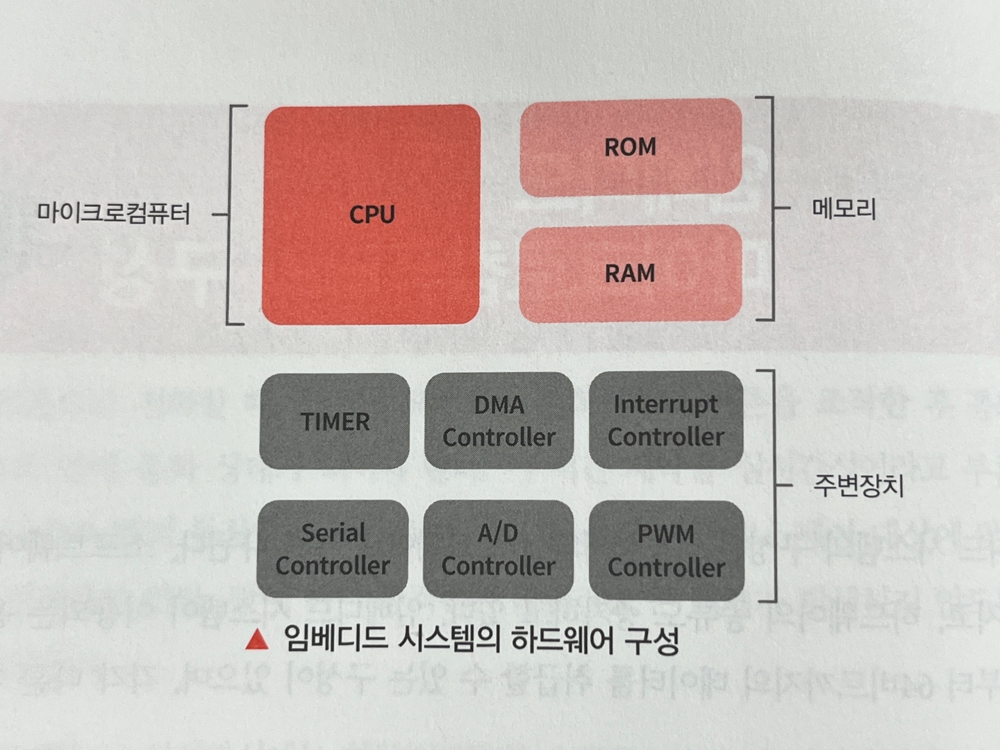

### 02. CPU
- **`CPU(Central Processing Unit)`**: 계산에 필요한 부품을 하나의 칩으로 합쳐 놓은 것
- 세계 최초의 마이크로컴퓨터: 1971년, Intel 4004, 4비트
- 주변장치: 주변에서 접속되는 하드웨어를 뜻하고, CPU로부터 제어됨.
- 버스(bus): CPU의 지시는 버스를 경유하여 전달되고, 주변장치로부터의 출력도 버스를 경유하여 CPU에 전달

### 03. 메모리
- **`메모리`**: 프로그램을 보관해두기 위한 하드웨어

### 04. ROM
- **`ROM`**: 읽기 전용 메모리
- CPU로부터 프로그램이 호출(명령 패치)되면 프로그램을 읽어 들여 CPU에 프로그램을 전달
- ROM의 내부에는 나뉜 구획(어드레스)이 있고, 각 구획에 기계어의 명령이 보관
- 프로그램 실행 시, CPU로부터 읽고 싶은 주소가 ROM에 전달, ROM은 그 주소에 적혀 있는 명령을 읽어서 CPU에 전달
- 비휘발성 메모리

### 05. RAM
- **`RAM`**: 프로그램을 실행할 때 일시적으로 데이터의 보관이 필요한 경우에 사용
- 프로그램 실행에 필요한 데이터 로딩(데이터 Read/Write)
- 휘발성 메모리

### 06. 메모리의 종류
- **`ROM의 종류`**
    - mask ROM: 제조 공정에서 메모리에 데이터를 써넣으면 바꿔쓸 수 없는 ROM
    - programmable ROM: 데이터를 기록한 후에도 바꿔쓸 수 있는 ROM
- **`RAM의 종류`**
    - DRAM(Dynamic RAM)
    - SRAM(Static RAM)
- **`eMMC`**
    - 읽기와 쓰기를 관리하는 컨트롤러와 NAND형 플래시 장치가 일체형으로 이루어진 메모리
    - SD카드처럼도 사용할 수 있음.
   
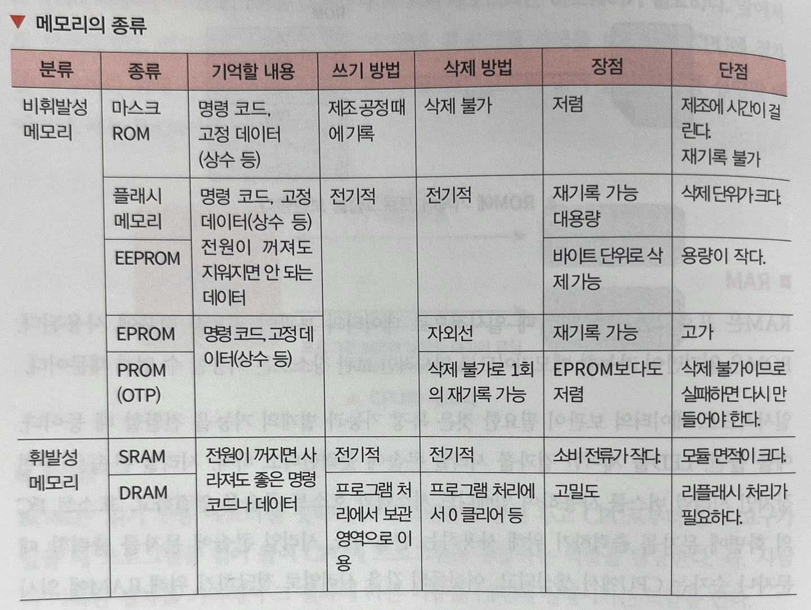

### 07. 메인 버스의 구성
- 시스템 전체의 데이터 흐름을 처리
- CPU와 메모리 또는 주변 장치 간 고속 데이터 전송 경로
- **`주소 버스`**:  메모리나 주변 장치에 접근할 특정 위치(주소)를 지정, 단방향
- **`데이터 버스`**: 메모리나 주변 장치와 데이터를 읽고 쓰는 통로, 양방향
- **`컨트롤 버스`**: 메모리나 주변 장치를 제어하는 데 필요한 신호를 전송,
    ex. 데이터를 읽고 쓰는 타이밍이나, 주변장치와 CPU 간의 제어에 필요한 신호를 전달하기 위해 사용
- **`클럭(clock)`**: 하드웨어의 동작 타이밍을 맞추기 위한 주기적인 신호

### 08. 로컬 버스의 구성
- 주변 장치와 CPU 간의 데이터 전송 지원
- 메인 버스의 클럭 속도보다 저속으로 동작하는 장치를 제어하는 신호선
- **`브리지`**
    - 메인 버스와 로컬 버스를 연결하는 컨트롤러로, 하드웨어 구성에 따라 다른 이름으로 부름.
    - 메인 버스와 로컬 버스의 속도차를 통제해주는 하드웨어
    - 저속의 로컬 버스로부터의 데이터를 관리, 고속의 메인 버스 타이밍에 맞추어 데이터를 송수신

- **`UART(Universal Asynchronous Receiver/Transmitter)`**
    - 동기식 직렬 신호를 병렬 신호로, 병렬 신호를 직렬 신호로 변환하는 하드웨어
    - 병렬 신호를 직렬의 데이터 신호로 변환하여 직렬 신호로 송신(Tx)
    - 직렬 신호를 수신(Rx)해서 복수의 데이터 신호가 될 때까지 데이터를 담아두고 병렬 데이터로 변환 후 송신
    - UART끼리 통신 방식은 비동기 직렬 통신
    - 비동기 방식은 보조 동기 방식
    - 임베디드 시스템에서는 시리얼 콘솔로 테스트나 디버깅할 때 많이 이용
      
    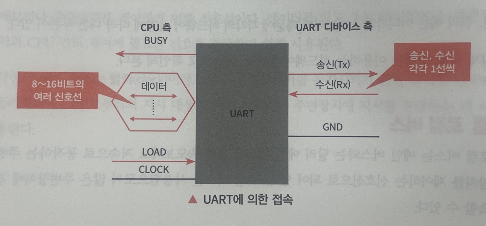

+ **`PLUS`**
    - UART 끼리 통신은 어떨 때 필요한가? 센서 데이터 처리용 보조 MCU와 주 MCU간 데이터 전송 시, 데이터 로깅 및 모니터링
    - 비동기 통신? 클럭 신호를 송신 측과 수신 측 간에 공유하지 않는 통신 방식
    - 보조 동기 방식? 시작 비트와 정지 비트를 이용하여 데이터의 시작과 끝을 식별
    - 미리 설정된 동일한 보드레이트를 사용해 동기화
    - 보드레이트(baud rate)? 1초 동안 신호 상태가 변하는 횟수
    - 비트 레이트(bit rate)? 1초 동안 전송할 수 있는 비트의 수
        - 표준 모드, 저속 모드, 버스트 모드, 고속 모드, 버스트 모드 플러스, 울트라 버스트 모드
    - 직렬 통신? 데이터를 하나의 비트 단위로 순차적 전송
    - 병렬 통신? CPU 등 내부 장치는 데이터를 병렬 형태(동시에 여러 비트)로 처리

- **`I2C`**
    - 시리얼 클럭(Serial CLock, SCL)과 양방향 시리얼 데이터(Serial DAta, SDA)의 2개의 신호선을 사용하여 통신하는 동기식 직렬 통신
    - 마스터(주) 장치와 슬레이브(종) 장치라는 관계가 있어서 복수의 슬레이브 장치에 접속할 수 있음.
    - 마스터 장치는 개별로 정해진 슬레이브의 주소를 지정하여 슬레이브 장치를 선택해 통신
    - 터치 센서나 가속도 센서 등 센서 디바이스의 접속에 자주 이용
  
    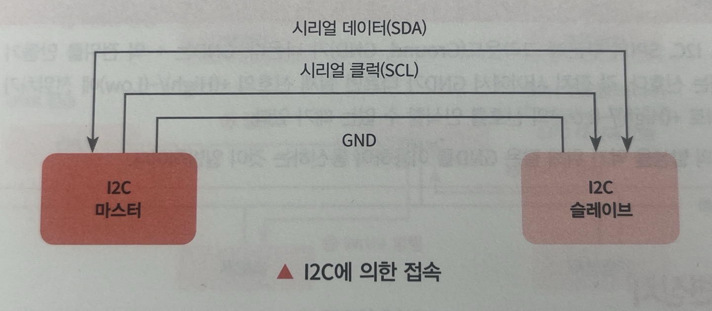

+ **`PLUS`**
    - SCL (Serial Clock): 마스터 장치가 생성하는 클럭 신호로 통신을 동기화
    - SDA (Serial Data): 데이터를 주고받는 양방향 신호선으로 마스터와 슬레이브가 데이터를 송수신
    - I2C는 SCL을 기준으로 데이터 비트(SDA)를 동기화하여 전송

- **`SPI`**
    - SCK(시리얼 클럭)와 단방향의 시리얼 데이터 인(Serial Data In, SDI), 시리얼 데이터 아웃(Serial Data Out, SDO)
    - 위의 세 가지 신호선으로 통신하는 동기식 직렬 통신
    - 슬레이브 디바이스를 선택하려면 제어 버스인 슬레이브 셀렉트(Slace Select, SS)를 이용해 마스터가 슬레이브 디바이스를 선택해 통신
    - I2C보다 많은 신호선이 필요하지만, 데이터 포맷이나 원리가 단순하여 I2C 버스보다 고속으로 통신 가능

+ **`PLUS`**

- **`GND`**
    - 기준 전위 OV를 제공하는 신호
    - UART, I2C, SPI 등 시리얼 통신에서는 전위 차이가 생기지 않도록 같은 GND를 공유해야 함.
    - 모든 장치가 동일한 기준 전위를 사용하면 정확한 신호 전송과 수신이 가능
 

### 09. 주변장치
- **`DMA(Direct Memory Access) 컨트롤러`**
    - 직접 메모리에 액세스하는 주변장치
    - PIO(Programmed I/O): CPU가 메모리와 주변 장치 간의 데이터 전송을 직접 제어
    - DMA는 CPU를 사용하지 않고 메모리의 데이터를 읽고 쓰는 주변장치
    - DMA 실행 시에는 버스 아비터가 버스를 사용하는 우선순위를 결정하여 데이터가 충돌하지 않도록 제어
    - 버스 아비터(bus arbiter): 시스템 버스를 사용할 수 있는 장치를 결정하고, CPU와 주변 장치 간에 데이터 전송 우선순위를 결정하는 장치
  
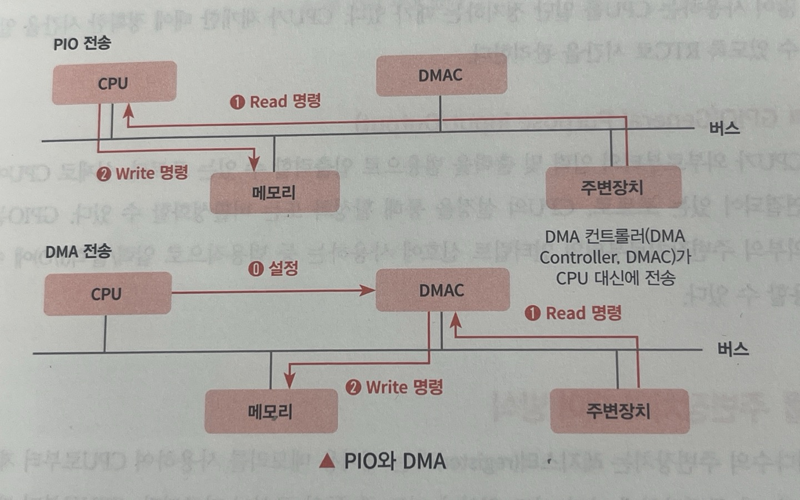
 

- **`DMA 장점`**
    - CPU가 다른 연산을 수행할 수 있어 시스템의 전체 성능이 향상
- **`DMA 단점`**
    - DMA가 버스를 점유하게 되면, CPU와 다른 주변 장치가 버스를 사용할 수 없기 때문에(충돌 방지) 메모리나 다른 장치들의 액세스가 지연
    - 전송 시 설정 내용이 잘못되면 큰 사고가 발생

- **`타이머`**
    - 임베디드 시스템에서 시간 기반 처리를 구현하는데 필수적인 주변장치
    - 시간 관련 처리: 시스템에서 주기적인 작업(감시 및 데이터 출력)을 실행하거나 시간 경과를 감지하는 데 사용
    - 카운터 레지스터를 이용하여 시간을 측정
    - 주기 시간이 경과되면 인터럽트를 발생시켜  CPU에게 주기 시간이 경과했음을 알림.
    - CPU는 이를 받아들여 해당 인터럽트에 대한 처리를 실현

- **`RTC(Real Time Clock)`**
    - 임베디드 시스템에서 정확한 시간을 추적하고 관리하는 데 사용하는 주변 장치
    - 시간을 한번 설정해두면 전원이 꺼지지 않는 한 지속적으로 시간을 추적하고 업데이트
    - 임베디드 시스템에서는 전력 소비를 최소화하기 위해 CPU가 절전 모드로 들어가는 경우가 있음.
    -  RTC는 계속 작동하여 CPU가 재개한 때에 정확한 시간을 복원할 수 있도록 함.

- **`GPIO(General Purpose Input/Output)`**
    - 범용 입력/출력 포트로, CPU와 외부 장치 간의 기본적인 신호 전달을 위해 사용
    - CPU와 연결되어 있으며, 소프트웨어나 하드웨어 설정을 통해 활성화/비활성화할 수 있음.
    - GPIO 핀에서의 입력 신호 변화를 감지하고, 이를 통해 인터럽트를 발생시킬 수 있음.
    + UART, SPI, I2C와 같은 통신 프로토콜은 GPIO 핀을 이용해 설정하고 데이터를 주고받을 수 있음.
  

### 10. 주변장치의 제어방식
- CPU가 외부 장치와 데이터를 주고받거나 제어할 수 있도록 하는 방식으로, 레지스터를 통한 읽기/쓰기를 통해 제어
- CPU 아키텍처나 시스템의 요구사항에 따라 제어방식이 다름.

- **`메모리 맵드 I/O(Memory-Mapped I/O)`**
    - ROM, RAM과 같은 메모리 영역과 공통의 주소 공간을 사용하여 주변장치를 제어하는 방식
- **`I/O 맵드 I/O(Port-Mapped I/O)`**
    - 주변장치의 제어는 메모리와 다른 주소 범위를 사용하며, 특정 I/O 명령어를 통해 제어
  
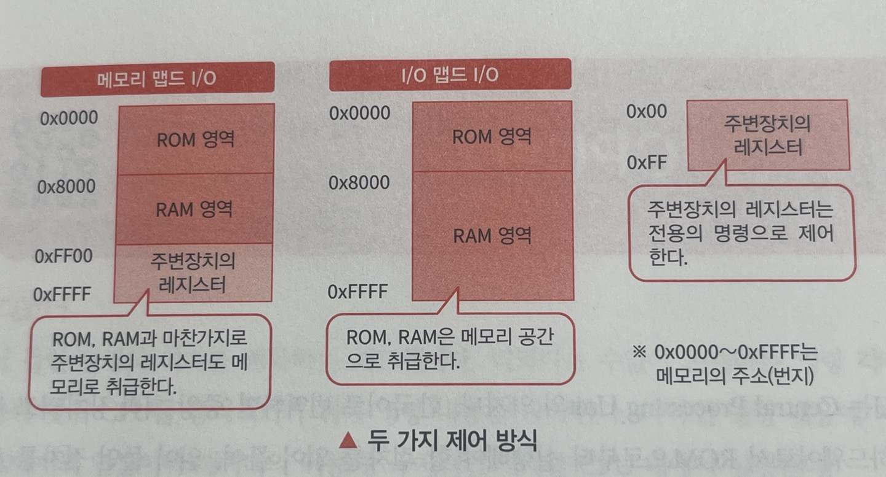
 

## Section 08. CPU란?
### 01. CPU의 구조
- **`CPU(Central Processing Unit)의 구조`**

    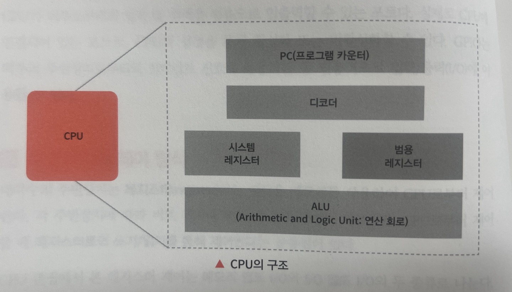  

- **`프로그램 카운터(PC: Program Counter)`**
    - CPU가 실행해야 할 명령의 주소를 저장하는 레지스터
    - 프로그램 실행 순서를 제어
    - 다음에 실행해야할 명령의 주소를 CPU에 전달하는 역할
- **`디코더`**
    - CPU가 실행할 명령어를 읽어 들이고, 이를 해석하여
    - 각 부품에 적절한 명령을 전달하는 하드웨어
- **`ALU`**
    - 수학적 연산(사칙 연산, 비교 등)과 논리 연산(AND, OR, NOT 등)을 수행하는 회로
    - 디코더에서 제공한 제어 신호에 따라 연산을 실행
    - 그 결과를 범용 레지스터나 시스템 레지스터에 저장
- **`범용 레지스터`**
    - CPU에 내장된 범용 메모리
    - 고속이지만 용량이 작은 메모리
    - CPU가 프로그램을 실행할 때에 일시적으로 이용하는 메모리
    - ALU에서 연산 결과를 보관하는 어큐뮬레이터나 데이터를 이동할 때의 보관 장소로 이용
- **`시스템 레지스터`**
    - CPU 내부에서 시스템 상태나 제어 정보를 저장하는 특수한 레지스터
    - 명령 레지스터(IR), 주소 레지스터(AR), 상태 레지스터(SR)
  
     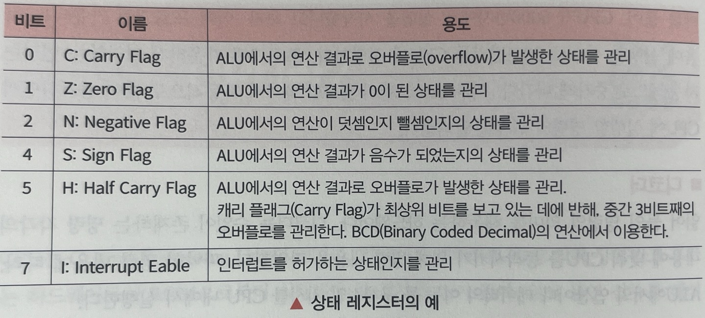
  

### 02. CPU의 명령 실행
- **`CPU 명령의 절차`**
    - **`명령 패치 사이클`**
        - CPU가 프로그램 카운터(PC)에 저장된 주소를 기반으로
        - 메모리(ROM 또는 RAM)에서 실행할 명령어를 추출
    - **`명령 디코드 사이클`**
        - 명령 레지스터(IR)에 저장된 명령어를 디코더가 해석하여
        - 실행에 필요한 제어 신호를 생성
    - **`실행 사이클`**
        - 디코더가 생성한 제어 신호에 따라 명령이 실행
    - **`라이트 백 사이클`**
        - 명령 실행의 결과를 레지스터 또는 메모리에 저장
  
 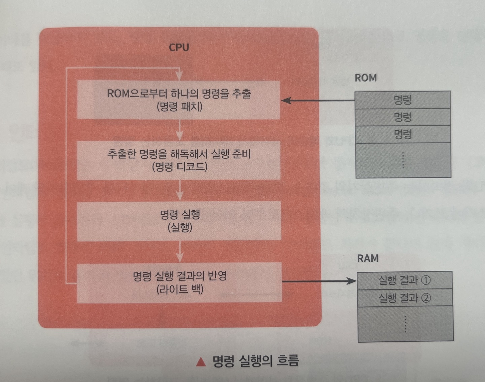

- **`CPU 명령의 종류`**
    - CPU와 메모리 사이에서 데이터를 교환하는 명령  
     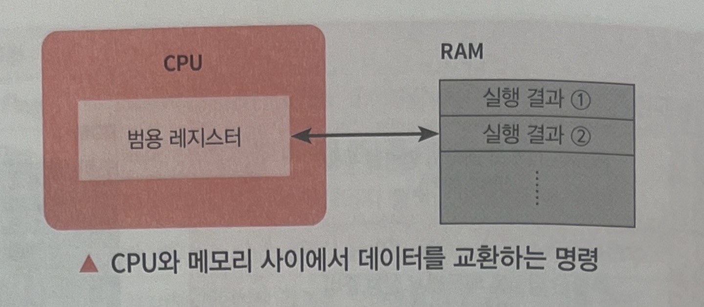

    - CPU와 주변장치 사이에서 데이터를 교환하는 명령  
     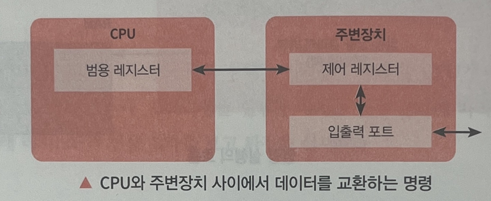

    - CPU 안에서만 실행되는 명령  
     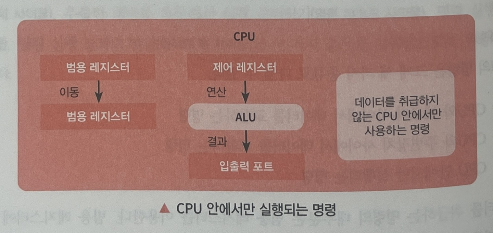

 

### 03. 인터럽트
- **`인터럽트`**
    - 주변장치나 내부 하드웨어가 CPU에 처리 요구를 알리기 위해 보내는 신호
    - CPU는 주기적으로 인터럽트를 감시
    - 신호가 발생하면 현재 작업 상태를 저장한 뒤 인터럽트 처리 루틴으로 전환
- **`인터럽트 벡터 테이블`**
    - CPU가 특정 인터럽트가 발생했을 때 실행해야 할 코드의 시작 주소를 저장하는 메모리 테이블
    - CPU는 벡터 테이블에서 해당 인터럽트에 대한 처리 루틴의 주소를 읽어 실행
- **`타이머 인터럽트`**
    - CPU 내부의 타이머가 설정된 시간이 경과했을 때 발생하는 인터럽트
- **`외부 인터럽트`**
    - 주변장치나 외부 하드웨어가 CPU에 보낸 인터럽트
- **`인터럽트 요인`**
    - 타이머 처리: 주기적 작업 실행
    - DMA 처리: 대량 데이터 전송 완료 신호
    - 스위치 처리: 버튼 눌림 감지
    - 렌더링 처리: 그래픽 처리와 관련된 작업
    - 시리얼 처리: UART 등의 시리얼 통신 완료 신호
- **`인터럽트 벡터`**
    - 인터럽트 종류에 따라 미리 정의된 메모리 주소
    - 정해진 메모리 영역에 인터럽트 발생 시 실행할 핸들러 코드의 시작 주소를 등록
- **`인터럽트의 우선순위`**
    - 동시에 여러 인터럽트가 발생했을 때, 어떤 인터럽트를 먼저 처리할지 결정하는 기준
    - 임베디드 시스템 개발에서의 고생 중 하나
