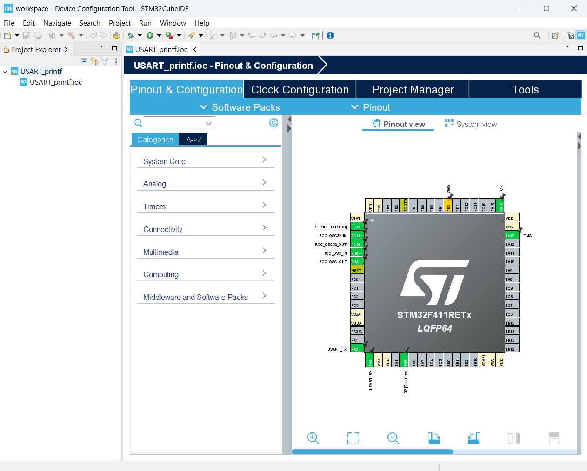

스터디 진행 날짜: 25.01.07. <br>
STM32CubeIDE를 이용한 STM32 따라하기 pp.100 ~ 117 <br>
참고 도서: 김남수, 이진형, STM32CubeIDE를 이용한 STM32 따라하기, 북랩

# Chapter 3.2. printf 시리얼 디버깅
- 다양한 디버깅 툴과 방법들이 있지만, 임베디드 시스템 개발 환경 구축에 있어 printf를 이용한 소스 디버깅은 절대적인 방법임.
- 가장 간단하면서 임베디드 플랫폼에 공통적인 방법

## 3.2.1. STM32CubeIDE 실행
- STM32CubeIDE를 실행한다.

## 3.2.2. 프로젝트 생성
- New -> STM32Project
- Target Selection -> Board Selector
- Board Filters -> Type -> Nucleo64
                -> MCU Series -> STM32F4 -> STM32F411RE -> Next

- Project Name: "USART_printf" -> Finish <br><br>


- 나머지는 기본 설정 불러오기 Yes 2번 연타
- 프로젝트 탐색기에 USART_printf 프로젝트가 생성되었나 확인.
- 확장자는 ioc <br><br>


- 기본적인 입출력 핀으로 Serial Wire 3핀(SWO/TCK/TMS), USART2 2핀, Button(B1), LED(LD2)가 할당되어 있음.

* SWO - PB3
* TCK - PA14
* TMS - PA13
* USART_TX - PA2
* USART_RX - PA3
* B1 - PC13-ANTI_TAMP
* LD2(Green) - PA5
* RCC_OSC32_IN, RCC_OSC32_OUT, RCC_OSC_IN, RCC_OSC_OUT

* https://os.mbed.com/platforms/ST-Nucleo-F411RE/

* stm32f4xx_hal ?
- HAL는 Hardware Abstraction Layer로, STM32 마이크로컨트롤러에서 최대의 이식성을 보장하는 STM32 추상화 계층 임베디드 소프트웨어
- HAL은 LL대비 high level의 API를 제공하고, 이식성이 높음.
- MCU 및 주변 장치 사양에 대한 심층적인 지식이 없이도 사용 가능.
- https://deepbluembedded.com/stm32-hal-library-tutorial-examples/#:~:text=The%20STM32CubeMX%2C%20a%20graphical%20software,for%20a%20set%20of%20peripherals.

* UART와 USART의 차이점
- USART 통신에서는 동기화 CLK에 따라 데이터를 전송

### PA 포트 (GPIO A)

### PB 포트 (GPIO B)

### PC 포트 (GPIO C)

### JTAG/SWD
- STM32 보드는 디버깅을 효율적으로 할 수 있도록 SWD (Serial Wire Debug) 및 JTAG 디버깅 프로토콜을 지원
- SWD 프로토콜을 사용하면, 4개의 핀(PB3, PA14, PA13, GND)을 통해 효율적인 디버깅 환경을 구축할 수 있음.
- TMS(PA13)와 TCK(PA14)는 디버깅의 동기화 신호를 제공 (TCK: 디버깅 클럭 신호, TMS: 디버깅 제어 신호)
- SWO(PB3)는 디버깅 중 시스템 이벤트나 로그 실시간 출력

## 3.2.3. Pinout & Configuration 설정

### 1. RCC 설정
- Categories -> System Core -> RCC
- HSE: Disable
- LSE: Disable <br><br>


* RCC(Reset and Clock Control): STM32에 있는 각 모듈의 동작 주파수를 제어하는 모듈

* Oscillator 종류
* 오실레이터: 주기적인 시간 변화 신호를 생성하는 전자 회로
| Speed      | External | Internal |
|------------|----------|----------|
| High Speed | HSE      | HSI      |
| Low Speed  | LSE      | LSI      |

* HSE(High Speed Clock)
* LSE(Low Speec Clock)
* HSE, LSE를 Disable로 설정하는 이유?

### 2. USART2 설정
- Categories -> Connectivity -> USART2
- Mode: Asynchronous
	- 왜냐면, 이번 실습은 UART 실습이기 때문
- 보통 USART1은 외부 장치와의 통신 목적으로 사용, USART2는 ST-LINK와 연결되어 있어 시리얼 통신에 사용
- Configuration -> Parameter Settings -> Baud Rate: 115200 Bits/s <br><br>


## 3.2.4. Clock Configuration 설정
- System Clock Mux -> PLLCLK
- HCLK: 84MHz  <br><br>


* PLLCLK(Phase-Locked Loop Clock): 주파수 합성기
* Clock Mux (Clock Multiplexer): 클럭 선택기

## 3.2.5. GENERATE CODE
- Project -> Generate Code
- Core 폴더 -> Src 폴더 -> main.c

## 3.2.6. 프로젝트 빌드
- Build -> Build Project : 정상 빌드 확인 <br><br>


printf 함수를 처리하기 위해서는 syscalls.c 파일이 필요

## 3.2.7. 소스 코드 작성
* NUCLEO 보드는 USART2 Peripheral을 통해 시리얼 통신을 할 수 있음.
- STM32는 표준 입출력 장치에 대한 정의가 되어 있지 않아 printf 출력 경로를 USART2로 재정의
- printf 함수의 디버깅 메세지 출력을 표준 장치에서 USART2로 출력이 되도록 소스를 포팅하는 것만으로 쉽게 터미널 디버깅 환경 구축 가능
- 재정의 후 디버깅 메세지는 UART를 통해 ST-LINK의 Virtual COM Port 로 전송되어 터미널에서 올바른 Port 설정하면 디버깅 메세지 확인 가능

### 1. stdio.h 헤더 파일 추가
- printf 함수 사용을 위해 stdio.h 헤더 파일 추가

### 2. 표준 출력 장치를 USART2 장치로 포팅하는 코드 작성
```
/* Private user code ---------------------------------------------------------*/
/* USER CODE BEGIN 0 */
#ifdef __GNUC__
/* With GCC, small printf (option LD Linker->Libraries->Small printf
 set to ‘Yes’) calls __io_putchar() */
/* GNU GCC 컴파일러를 사용할 경우 */
#define PUTCHAR_PROTOTYPE int __io_putchar(int ch)
#else
#define PUTCHAR_PROTOTYPE int fputc(int ch, FILE *f)
#endif /* __GNUC__ */

/**
 * @brief Retargets the C library printf function to the USART.
 * @param None
 * @retval None
 */
PUTCHAR_PROTOTYPE
{
	/* Place your implementation of fputc here */
	/* e.g. write a character to the USART1 and Loop
	   until the end of transmission */
	/* 새 줄 문자를 전송할 때 줄 바꿈을 맞추기 위해 \r 추가 */
	if (ch == '\n')
		HAL_UART_Transmit (&huart2, (uint8_t*) "\r", 1, 0xFFFF);
	HAL_UART_Transmit (&huart2, (uint8_t*) &ch, 1, 0xFFFF);

	return ch;
}
/* USER CODE END 0 */
```
- printf 함수를 사용해 데이터를 출력할 때, 호출되는 내부 함수를 사용자 정의로 재정의하기 위해 전처리 설정
- 포인터 단위로 처리하는 read, write 대신, 표준 입력을 받아서 1바이트 단위로 처리하는 io_putchar, fputc 사용
https://wikidocs.net/160158

- UART_HandleTypeDef 구조체
```
Instanance: UART descriptor 의 포인터 변수로 USART1, USART2 등으로 define 되어있다.
Init: UART_InitTypeDef 구조체 변수이고 각종 설정 값들을 지정한다.
pTxBufferPtr / pRxBufferPtr: 송수신 버퍼 포인터이다.
TxXferSize / RxXferSize: 송신.수신할 데이터의 크기
TxXferCount / RxXferCount: 송신/수신된 바이트 크기
hdmatx / hdmarx: Tx / Rx 용 DMA 핸들
Lock: HAL 내부적으로 사용하는 동기화용 변수
gState: Tx 를 포함한 UART 상태 값
RxState: Rx 상태 값
ErrorCode: 에러 코드
```
- HAL_UART_Transmit: STM32 HAL 라이브러리의 함수로, UART로 데이터를 전송
- HAL_UART_Transmit(&huart2, data, size, timeout);
- huart2: USART2를 사용하는 UART 핸들 구조체
- uint8_t: 8비트 ascii 문자를 보내기 때문에 해당 자료형 사용
- 0xFFFF: 타임아웃 값(데이터 전송 대기 최대 시간), 블로킹 방식으로 동작

### 3. printf 함수를 통한 메시지 출력 코드 작성
- "Hello World!" 출력
- HAL_Delay() 함수를 이용하여 1초 지연 추가
```
  /* USER CODE BEGIN WHILE */
  while (1)
  {
	  printf ("Hello World!\n");
	  HAL_Delay (1000);
    /* USER CODE END WHILE */

    /* USER CODE BEGIN 3 */
  }
```

## 3.2.8. 프로젝트 빌드 및 보드에 다운로드
- Run -> Run<br><br>


## 3.2.9. 터미널 프로그램 확인
- 윈도우: Tera Term을 사용하여 시리얼 통신 가능
- 우분투:  minicom을 사용하여 시리얼 통신을 설정하고 확인 가능
### 1. minicom 설치
```sudo apt install minicom```

### 2. 디바이스 연결 확인
디바이스 연결 후, 아래 명령어를 사용하여 디바이스 포트를 확인
```sudo dmesg | grep tty```
출력 예시: /dev/ttyACM0

### 3. minicom 설정
```sudo minicom -s```
Serial port setup 선택 후 아래 설정을 변경
A: Serial Device → /dev/ttyACM0 (확인한 디바이스 포트로 변경)
설정을 완료한 후, Save setup as dfl로 저장

### 4. 프로젝트 빌드 및 실행
프로젝트를 빌드하고 실행한 후, 아래 명령어로 minicom을 실행
```sudo minicom```
정상적으로 연결되었다면, minicom 터미널에서 데이터 송수신을 확인할 수 있음.
