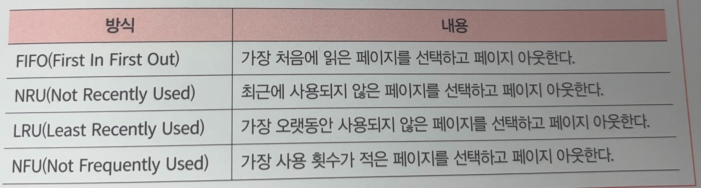
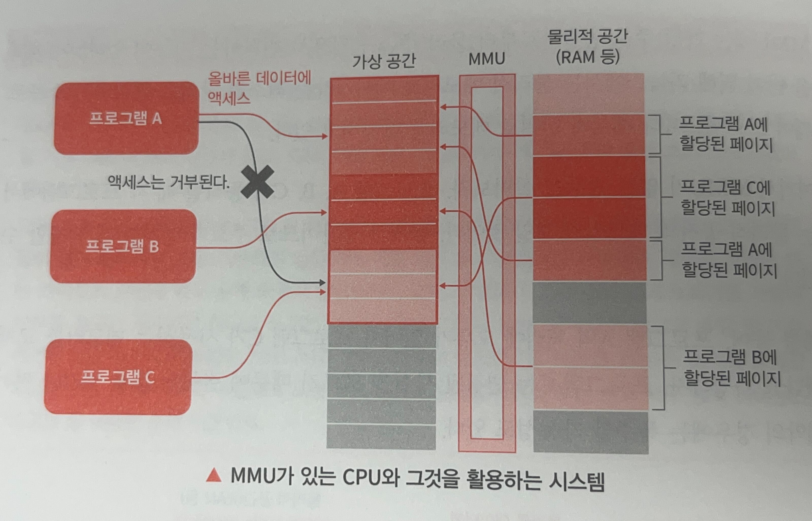

# SECTION 23. 데이터 주도 사회
## 1) 데이터의 활용
- 데이터 주도 사회: 스마트 디바이스(Smart Device)를 활용하여 사회의 문제를 해결

# SECTION 24. 스마트 디바이스
## 1) 스마트 디바이스란?
- 스마트 디바이스: 화면과 터치패널, 통신 기능을 갖추고 있는 기기를 총칭하는 말.
- ex. 스마트폰(태플릿), 스마트워치, 스마트 글라스, 스마트 가전 등

## 2) 스마트 디바이스의 사용 예

### (1) 키오스크(KIOSK) 단말
- 캐시리스(cashless) 결제 -> 셀프 계산대
물건을 놓으면 자동으로 물건의 개수, 가격이 결정
신용카드 삽입하여 현금 없이 결제할 수 있는 기기
- 셀프 메뉴판
터치 스크린 조작 가능
사용자가 이해하기 쉬운 GUI 조작
주문한 것은 주방으로 송신
주문 시스템에 주문 수량과 가격이 전달
-> 매출 실적 관리 POS 시스템과 연동

### (2) 웨어러블(wearable) 디바이스
- 사람이 착용해서 이용하는 스마트 디바이스
- 스마트 글라스
AR, VR, MR 등 가상화 기술을 사용
길 및 관광 안내, 공장이나 건설 현장 등에 사용

## 3) 스마트 디바이스의 구성
- 그래픽과 통신 기기에 대한 고려
- 고성능 하드웨어와 대규모 소프트웨어로 구성

### (1) 스마트 디바이스의 하드웨어 구성
- GUI(Graphical User Interface)를 실현하기 위한 디스플레이 및 터치 패널
- 32비트 이상의 고성능 CPU
- or GPU 탑재
- 왜 고기능 마이크로컴퓨터를 사용하는가?
=> 실시간성 확보를 위함.
- 다른 장치와의 통신 및 서버와의 통신 실시
- 스마트 디바이스를 제작할 수 있는 디바이스
ex. 라즈베리 파이3
 

**라즈베리 파이 3의 하드웨어 구성**  

- 작은 구현 면적
- 저전력

- SoC(System on a Chip): 제품을 실현하기 위해 다양한 주변기기와 CPU를 하나의 칩으로 제공하는 하드웨어
ex. 스마트폰: 퀄컴의 스냅드래곤 채용
ex. 라즈베리 파이 3B+: 브로드컴 사의 BCM2837
- LSI: Large-Scale Integration
  - 다수의 집적회로를 하나의 기판에 배선하여 고차의 집적화를 한 회로
- CSI: Camera series interface
  - 이미지 센서에서 AP로 사진이나 영상을 전송하기 위해 널리 사용되는 고속 프로토콜
- AP: Application Processer

### (2) 스마트 디바이스의 소프트웨어 구성
- 스마트폰에서 높은 점유율을 가진 운영체제: 안드로이드 및 iOS
- OSS(Open Source Software)를 적극 활용하기

### (3) BSP를 활용한 소프트웨어 개발

#### BSP(Board Support Package)
- SoC의 칩 벤더를 통해 제공되는 대규모 소프트웨어
  - SoC의 칩 벤더(chip vendor): 메모리 칩 제조사
- 커널, HAL, 미들웨어, 기본적인 애플리케이션, 윈도우 관리자 등으로 구성
- 이를 활용하여 화면 제어 및 통신 제어 등 다양한 기능이 멀티로 동작할 수 있음.
- 안드로이드, 리눅스(Yocto) 무료 제공
- 실시간 운영체제 (FreeRTOS, NuttX 등) 사용
- 레퍼런스 보드 (유료 제공)
- 하드웨어를 추상적으로 제어할 수 있는 소프트웨어 계층으로 되어 있음.
=> 애플리케이션이 액세스하고 싶은 하드웨어가 달라도 그 차이를 의식하지 않은 채 정해진 API로 이용할 수 있다.  

**BSP와 HAL의 차이**
- HAL: 하드웨어의 기본적인 기능(I2C, SPI, UART 등)을 추상화해 공통 API를 제공
- BSP: HAL을 기반으로 보드에 특화된 설정과 장치 초기화를 수행(=> 특정 하드웨어 보드에서 운영 체제가 실행되도록 지원하는 소프트웨어 패키지)
- 애플리케이션: BSP를 통해 하드웨어와 통신하거나 HAL의 추상화된 API를 간접적으로 사용

- 레퍼런스 보드: 제조업체가 해당 하드웨어 플랫폼에서의 소프트웨어 개발, 테스트, 검증을 용이하게 하기 위해 개발자에게 제공하는 표준 설계 보드

### (4) BSP에서의 소프트웨어 개발 포인트

#### BSP 기능 파악하기

  

- 제공되는 BSP에 어떤 기능이 있는지 파악
- 오픈 소스 소프트웨어라면 다양한 테스트를 하면서 기능을 파악할 수 있음.

#### 자체 개발, 외부 조달, 오픈 소스 소프트웨어를 조합한 설계
- 자체 개발 부분과 외부 조달 부분, 오픈 소스 소프트웨어 활용 부분 등 아키텍처 설계를 실시
- 유지보수를 포함한 제품의 라이프 사이클 생각하여 설계

### (5) 보안 위협
- 인터넷을 사용하여 서비스를 제공하는 경우, 정보 유출이나 도청 등 행위 및 데이터 자체를 변조하는 위협 존재
- 위험 분석, 위협 분석, 취약성 완화 등 지식 필요

# SECTION 25. 임베디드 리눅스
## 1) 리눅스 운영체제를 사용하는 이유
- 임베디드 제품의 다기능화: 8비트, 16비트 CPU -> 32비트, 64비트 CPU
- 하드웨어 진화 -> 소프트웨어 다양한 기능 요구 (ex. 네트워크, 파일 시스템, 터치 패널 및 센서 디바이스의 장치 드라이버)
- 리눅스 운영체제: 무료로 이용 가능한 미들웨어 및 장치 드라이버가 풍부 

#### 무상과 라이선스 조항
- GPL 라이선스 '모두가 같이 공유하자'
=> 오픈 소스 소프트웨어를 프로젝트 개발에 사용한 때는 라이선스 조항에 따라 공개 의무가 발생하기도 함.

## 2) 리눅스 운영체제가 동작하는 하드웨어 구성
- 최소한의 구성: CPU, ROM, RAM
=> 소프트웨어 동작 가능
- 리눅스의 경우 MMU(Memory Management Unit)까지 있는 것이 권장
- 리눅스의 탄생 배경: 인텔의 CPU가 16비트에서 32비트로 전환되는 시기에 PC에서 동작하는 운영체제로 탄생

### (1) MMU
- 가상으로 취급하는 주소 공간과 물리적으로 취급하는 주소 공간
- 가상 주소 공간: CPU가 다룰 수 있는 32비트 공간, 프로세스가 사용하는 논리적인 메모리 공간
- 물리 주소 공간: 실제로 하드웨어가 장착한 메모리 용량을 취급하는 공간
- MMU에는 가상 주소 공간으로부터 물리 주소 공간으로 변환하는 기능 있음.

#### 페이지 기반 메모리 관리
- 물리 메모리와 가상 주소 공간을 일정한 크기의 페이지로 나눔
- 가상 주소 페이지와 물리 주소 페이지 간의 매핑 정보를 페이지 테이블에 저장
- MMU는 페이지 테이블을 참조하여 가상 주소를 물리 주소로 변환

#### 페이지 폴트

#### MMU가 없는 CPU에서의 문제점
- 프로그램 A가 메모리 일부를 사용하는 중에 오류로 인해 메모리 교체(스왑 또는 페이지 교체)가 발생하는 경우
- 이때 교체된 메모리 페이지가 프로그램 C에서 사용하는 페이지와 겹친다면?
프로그램 C는 변경된 사실을 모르기 때문에 잘못된 값을 읽거나 써서 폭주할 수 있음 
 

 

#### MMU가 있는 CPU와 그것을 활용하는 시스템
- MMU는 각 프로세스가 사용하는 메모리가 독립적이도록 보장
- 프로그램 전환 시 가상 공간 바뀜.
- 프로그램 A 처리에 오류가 있어서 프로그램 C가 사용하는 메모리를 수정하려 하면
=> 프로그램 A가 프로그램 C의 가상 공간에 액세스하려고 하면
=> MMU가 위반된 공간에 액세스하려는 것을 감지
=> CPU에 통지되어 잘못된 메모리의 변경은 실행되지 않음.
  

### (2) MMU가 없는 CPU에서 리눅스를 동작시키는 것은 가능한가?
- 가능
- uCLinux 사용
  - 리눅스 커널을 MMU가 없는 시스템에 맞게 수정하여, 가상 메모리나 페이지 관리 등의 기능을 배제하고, 더 간단한 방식으로 메모리를 관리
- 리눅스 커널의 구성에서 CONFIG_MMU 부분을 n으로 함으로써 MMU가 없는 CPU에 대응한 동작을 함.
- 커널은 물리 메모리만을 다루게 되며, 각 프로세스는 실제 메모리 주소만을 사용할 수 있음.

#### 리얼 모드와 보호 모드
- CPU가 작동하는 모드로, 주로 x86 아키텍처에서 사용
- 리얼 모드는 MS-DOS와 같은 초기 운영 체제에서 실행
- 초기 컴퓨터인 16비트 CPU 모드로, 최대 1MB 밖에 취급할 수 없었음.
- 이 한계를 넘기 위해 가상 공간을 사용할 수 있는 보호 모드가 추가
- 2비트로 확장된 CPU 모드로, 각 프로세스는 독립된 메모리 영역을 가지고, 다른 프로세스의 메모리 영역에 접근하지 못하도록 보호됨.

### (3) 32비트 이상의 CPU
- 소프트웨어 개발 관점에서 32비트 이상의 CPU가 리눅스 운영체제의 성능을 끌어 낼 최소한의 사양

### (4) 탑재 메모리
4GB의 메모리 시스템
3GB: 애플리케이션 동작하는 공간 -> 유저 공간(User Space)
1GB: 커널 공간
=> 프로세스 격리와 시스템 안정성을 확보
  

## 3) 리눅스 운영체제가 동작하는 소프트웨어 구성
- 리눅스 운영체제 커널(물리 공간에서 동작)
  - **하드웨어 제어**를 위한 드라이버, 네트워크 프로토콜, 파일 시스템 등 하드웨어를 추상적으로 이용하기 위한 스택
  - **시스템 전체 관리**를 위한 스케줄러, 메모리 관리 등
  - **/dev 인터페이스 제공**: 입출력 장치(예: 하드 드라이브, 터미널, 프린터 등)와의 데이터 전송
- 기타 소프트웨어 군
  - 커널이 제공하는 추상 인터페이스를 편리하게 이용하기 위한 라이브러리
  - 프로세스 간 통신을 위한 라이브러리
  - 기동 순서 등을 제어하는 데몬(daemon)
  - GUI를 제어하는 윈도우 관리자 등
- 기타 소프트웨어군이 동작하는 가상 공간 => 사용자 공간
